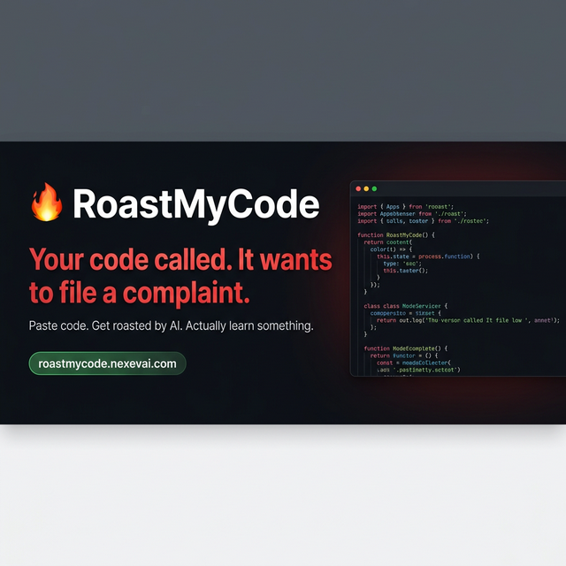
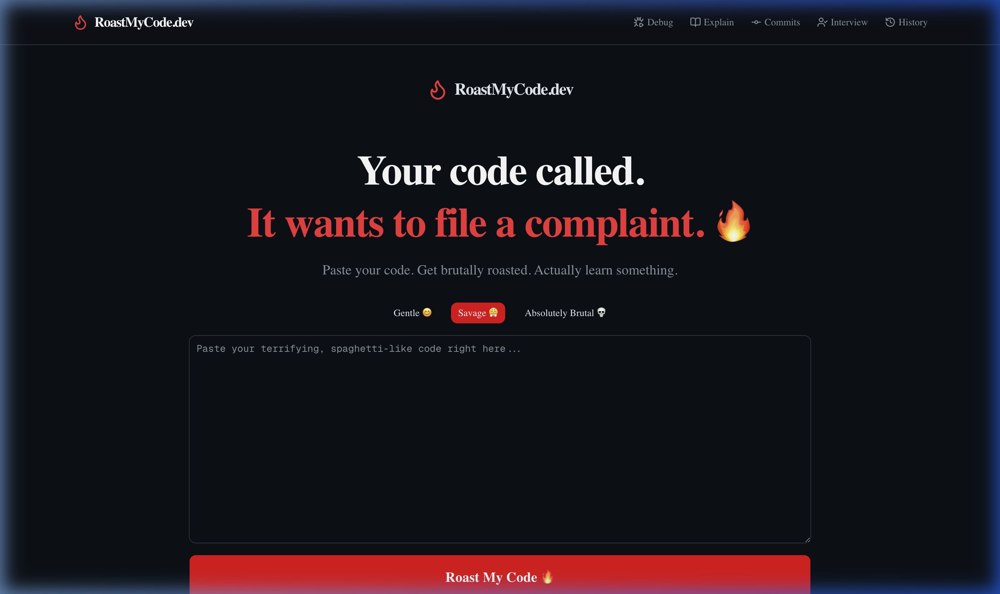
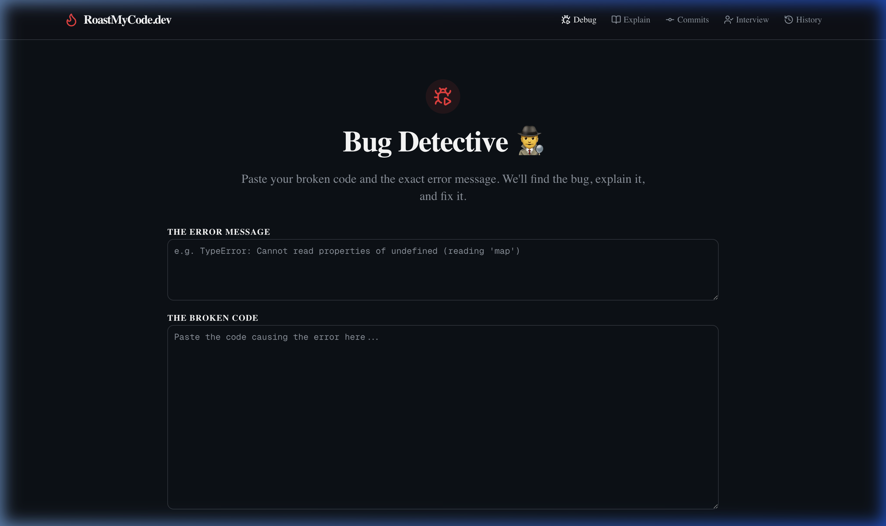

**Your code called. It wants to file a complaint.**

---

## ⚡ Try It Live — No Account Needed

**[roastmycode.nexevai.com](https://roastmycode.nexevai.com)**

Paste your code. Get brutally roasted. Actually learn something. Zero signup, zero credit card, zero mercy.

---

## 🚀 The Ultimate AI Roast Suite (7 Tools in 1)

RoastMyCode has evolved from a simple code reviewer into a full suite of AI-powered developer and productivity tools. 

### 1. RoastAnything Engine
We don't just roast code anymore. Choose your target and intensity (Gentle, Savage, Brutal):
- **\`</>\` Code Roaster**: Finds bad variable names, huge loops, and architectural sins.
- **🚀 Startup Idea**: Tests your idea against harsh market realities.
- **📊 Business Plan**: Exposes your "uber for dogs" revenue model.
- **📄 Resume**: Destroys your LinkedIn buzzwords before recruiters do.
- **📝 Essay**: Points out your grammatical errors and lack of thesis.
- **🐦 LinkedIn Post**: Calls you out for engagement farming.
- **🤔 Life Decision**: Calculates your actual "survival chance".

### 2. Hall of Shame Leaderboard
Disastrous roasts scoring 6/10 or below can be anonymously submitted to the global **Hall of Shame**.
- The community votes for the worst submissions.
- Built-in Redis rate-limiting (1 vote per IP, per day) to prevent gaming the system.
- Powered by persistent, edge-compatible Vercel KV storage.

### 3. Live Bug Detective

Paste your broken code and the terminal error message. The AI acts as a senior developer to instantly find the bug, explain *why* it happened, provide the corrected code, and offer a prevention tip.

### 4. Code Explainer
Drowning in legacy code? Paste a confusing snippet and get it explained in three different ways:
- **ELI5 (Like I'm 5)** — Simple metaphors.
- **Junior Dev** — Focuses on syntax and what it's doing.
- **Senior Architect** — Focuses on performance, trade-offs, and design patterns.

### 5. Commit Generator
Paste your `git diff` and let AI write your commit messages. Generates 5 distinct options ranging from strict Conventional Commits to brutally honest "Funny" commits.

### 6. Interview Question Generator
Paste any job description or tech stack. The AI generates 10 high-probability technical interview questions (Easy, Medium, Hard) and provides the *ideal* senior-level response for each.

### 7. Local History
Your personal, private "Hall of Shame". A local, `localStorage` driven history of your last 5 interactions so you can reference old roasts.

---

## ⚙️ Engineering & Architecture

This application was engineered for raw speed, high engagement, and perfect SEO.

### AI Implementation (Predictably Unpredictable)
- **High-Temperature LLMs**: We inject a dynamically shifting random seed into every prompt (e.g. "focus on naming" or "use movie analogies") and run high-temperature (`1.3`+) configuration for Gemini, OpenAI, and Claude to ensure the AI *never* generates the exact same roast twice.
- **BYOK (Bring Your Own Key) Architecture**: To keep the app 100% free, it runs via zero-storage browser proxy. Users can optionally bring their own Gemini, OpenAI, or Anthropic keys.
- **Fallback Server Routing**: If the user doesn't have a key, the app gracefully falls back to an internal secure Next.js API route to provide the first roast free.

### Viral Growth Mechanics
- **Live Social Proof**: Custom React hooks calculate an organic real-time counter of total roasts delivered.
- **Activity Ticker**: A sliding headline component simulates real-time activity ("A startup was just destroyed in London 🇬🇧") to build momentum.
- **Viral Share Cards**: Dynamic, color-coded HTML-to-Canvas outputs for 1-click Twitter sharing. 

### PWA & SEO Excellence
- **Progressive Web App**: fully installable via `next-pwa` with a seamless, custom-built Mobile Install Banner prompt. Caches assets locally (`NetworkFirst` strategy) for lightning-fast subsequent loads.
- **Dynamic OpenGraph**: Utilizing Next.js Edge runtime to dynamically generate social sharing preview cards on the fly `og/route.tsx`.
- **JSON-LD Structured Data**: Deeply injected JSON-LD schema across the `RootLayout` indicating we are a `WebApplication`, improving Google's Rich Snippets indexing.
- **Automated Sitemaps & robots.txt**: Next.js automatically outputs the sitemap map and crawler instruction routes.

---

## 🛠 Tech Stack

- **Framework**: Next.js 16 (App Router)
- **Design System**: Tailwind CSS, shadcn/ui, Framer Motion
- **Database**: Vercel KV (Redis)
- **Icons**: Lucide React
- **PWA**: next-pwa, sharp (Icon generation)
- **AI Integration**: Google Generative AI SDK `@google/generative-ai`

---

## 👤 Built By

**Rayees Yousuf** — AI Tools Developer

Building useful AI tools at [NexevAI](https://nexevai.com)

---

## ❤️ Support This Project

This tool is free and will always remain free. Star the repository to help others discover it!

  Made with fire and a complete lack of mercy for bad code. 
  <strong><a href="https://roastmycode.nexevai.com">roastmycode.nexevai.com</a></strong>

